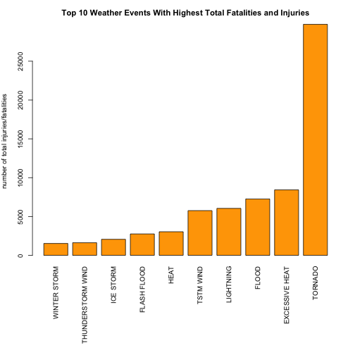
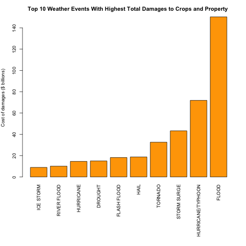

##IMPACT OF WEATHER EVENTS ON HEALTH AND ECONOMY


###Synopsis

Storms and severe weather events in the U.S. can negatively impact both public health and the 
economy, in terms of fatalities, injuries and property damage. This project will analyze data
from the U.S. National Oceanic and Atmospheric Administration's (NOAA) storm database and address
which type of events are the most harmful to population health and to the economy. 

An analysis of the storm data and the resulting plots show that **TORNADO**, **EXCESSIVE HEAT** and **FLOOD**
are the top 3 weather events that cause the most harm to the population in terms of total fatalities and injuries,
across the United States from 1989 to 2011.

Meanwhile, **FLOOD**, **HURRICANE/TYPHOON** and **STORM SURGE** are the top 3 weather events that cause the most 
economic damage to crops and property across the United States from 1989 to 2011.

The number of weather events breached the 10,000 mark starting 1989.  Hence this report analyzed a subset of the 
original data with those only from 1989 to 2011.  However a separate analysis using the entire storm data from
1950 to 2011 would have shown similar results to those from 1989 to 2011


###Data

The storm data is available in csv format from the course website: 

- [Storm Data](https://d396qusza40orc.cloudfront.net/repdata%2Fdata%2FStormData.csv.bz2) [47Mb]

Further documentation of the database is available at:

- National Weather Service [Storm Data Documentation](https://d396qusza40orc.cloudfront.net/repdata%2Fpeer2_doc%2Fpd01016005curr.pdf)

- National Climatic Data Center Storm Events [FAQ](https://d396qusza40orc.cloudfront.net/repdata%2Fpeer2_doc%2FNCDC%20Storm%20Events-FAQ%20Page.pdf)


###Retrieving data


Load the storm data into a data frame called data:


```r
URL <- "http://d396qusza40orc.cloudfront.net/repdata%2Fdata%2FStormData.csv.bz2"
destfile <- "repdata-data-StormData.csv"
download.file(URL, destfile)
data <- read.csv("repdata-data-StormData.csv")
rows <- nrow(data)
cols <- ncol(data)
```

The data frame contains 902297 rows (observations) and 37 columns (variables). 

Quick look at the first few data observations

```r
head(data)
```

```
##   STATE__           BGN_DATE BGN_TIME TIME_ZONE COUNTY COUNTYNAME STATE
## 1       1  4/18/1950 0:00:00     0130       CST     97     MOBILE    AL
## 2       1  4/18/1950 0:00:00     0145       CST      3    BALDWIN    AL
## 3       1  2/20/1951 0:00:00     1600       CST     57    FAYETTE    AL
## 4       1   6/8/1951 0:00:00     0900       CST     89    MADISON    AL
## 5       1 11/15/1951 0:00:00     1500       CST     43    CULLMAN    AL
## 6       1 11/15/1951 0:00:00     2000       CST     77 LAUDERDALE    AL
##    EVTYPE BGN_RANGE BGN_AZI BGN_LOCATI END_DATE END_TIME COUNTY_END
## 1 TORNADO         0                                               0
## 2 TORNADO         0                                               0
## 3 TORNADO         0                                               0
## 4 TORNADO         0                                               0
## 5 TORNADO         0                                               0
## 6 TORNADO         0                                               0
##   COUNTYENDN END_RANGE END_AZI END_LOCATI LENGTH WIDTH F MAG FATALITIES
## 1         NA         0                      14.0   100 3   0          0
## 2         NA         0                       2.0   150 2   0          0
## 3         NA         0                       0.1   123 2   0          0
## 4         NA         0                       0.0   100 2   0          0
## 5         NA         0                       0.0   150 2   0          0
## 6         NA         0                       1.5   177 2   0          0
##   INJURIES PROPDMG PROPDMGEXP CROPDMG CROPDMGEXP WFO STATEOFFIC ZONENAMES
## 1       15    25.0          K       0                                    
## 2        0     2.5          K       0                                    
## 3        2    25.0          K       0                                    
## 4        2     2.5          K       0                                    
## 5        2     2.5          K       0                                    
## 6        6     2.5          K       0                                    
##   LATITUDE LONGITUDE LATITUDE_E LONGITUDE_ REMARKS REFNUM
## 1     3040      8812       3051       8806              1
## 2     3042      8755          0          0              2
## 3     3340      8742          0          0              3
## 4     3458      8626          0          0              4
## 5     3412      8642          0          0              5
## 6     3450      8748          0          0              6
```


###Data Processing

Take a subset of the original data which include variables that are relevant to the analysis.
In particular, we will include the date, weather event, health and economic impacts

```r
mycol <- c("BGN_DATE", "EVTYPE", "FATALITIES", "INJURIES", "PROPDMG", "PROPDMGEXP", "CROPDMG", "CROPDMGEXP")
mydata <- data[,mycol]
library(data.table)
mydata = data.table(mydata)
dim(mydata)
```

```
## [1] 902297      8
```

```r
head(mydata)
```

```
##              BGN_DATE  EVTYPE FATALITIES INJURIES PROPDMG PROPDMGEXP
## 1:  4/18/1950 0:00:00 TORNADO          0       15    25.0          K
## 2:  4/18/1950 0:00:00 TORNADO          0        0     2.5          K
## 3:  2/20/1951 0:00:00 TORNADO          0        2    25.0          K
## 4:   6/8/1951 0:00:00 TORNADO          0        2     2.5          K
## 5: 11/15/1951 0:00:00 TORNADO          0        2     2.5          K
## 6: 11/15/1951 0:00:00 TORNADO          0        6     2.5          K
##    CROPDMG CROPDMGEXP
## 1:       0           
## 2:       0           
## 3:       0           
## 4:       0           
## 5:       0           
## 6:       0
```

The events in the database start in the year 1950 and end in November 2011. In the 
earlier years of the database, there are generally fewer events recorded, most likely
due to a lack of good records.  More recent years should be considered more complete.
This code chunk creates a new column called year, strips date and time and counts the 
number of weather events per year. 


```r
mydata$year = as.numeric(format(as.Date(mydata$BGN_DATE, format = "%m/%d/%Y %H:%M:%S"), 
                                "%Y"))
stormsByYear = mydata[, lapply(.SD, length), by = year, .SDcols = 1]
setnames(stormsByYear, 2, "count")
stormsByYear
```

```
##     year count
##  1: 1950   223
##  2: 1951   269
##  3: 1952   272
##  4: 1953   492
##  5: 1954   609
##  6: 1955  1413
##  7: 1956  1703
##  8: 1957  2184
##  9: 1958  2213
## 10: 1959  1813
## 11: 1960  1945
## 12: 1961  2246
## 13: 1962  2389
## 14: 1963  1968
## 15: 1964  2348
## 16: 1965  2855
## 17: 1966  2388
## 18: 1967  2688
## 19: 1968  3312
## 20: 1969  2926
## 21: 1970  3215
## 22: 1971  3471
## 23: 1972  2168
## 24: 1973  4463
## 25: 1974  5386
## 26: 1975  4975
## 27: 1976  3768
## 28: 1977  3728
## 29: 1978  3657
## 30: 1979  4279
## 31: 1980  6146
## 32: 1981  4517
## 33: 1982  7132
## 34: 1983  8322
## 35: 1984  7335
## 36: 1985  7979
## 37: 1986  8726
## 38: 1987  7367
## 39: 1988  7257
## 40: 1989 10410
## 41: 1990 10946
## 42: 1991 12522
## 43: 1992 13534
## 44: 1995 27970
## 45: 1994 20631
## 46: 1993 12607
## 47: 1996 32270
## 48: 1997 28680
## 49: 1998 38128
## 50: 1999 31289
## 51: 2000 34471
## 52: 2001 34962
## 53: 2002 36293
## 54: 2003 39752
## 55: 2004 39363
## 56: 2005 39184
## 57: 2006 44034
## 58: 2007 43289
## 59: 2008 55663
## 60: 2009 45817
## 61: 2010 48161
## 62: 2011 62174
##     year count
```

The **stormsByYear** shows that the number of weather events breached the 10,000 mark starting 1989.
Hence we can use a subset of the original data with those only from 1989 to 2011.  However a separate
analysis using the entire storm data from 1950 to 2011 would show similar results to those from 1989 to 2011. 


```r
storm = mydata[year >= 1989]
dim(storm)
```

```
## [1] 762150      9
```

For economic impact, we shall include property damage and crop damage data.
Transform the data into comparable numeric units as described in the code book.
For example, "B" = billions, "M" = millions, "K" = thousands, "H" = hundreds.


```r
storm$PROPDMGEXP = as.character(storm$PROPDMGEXP)
storm$PROPDMGEXP[toupper(storm$PROPDMGEXP) == "B"] = "9"
storm$PROPDMGEXP[toupper(storm$PROPDMGEXP) == "M"] = "6"
storm$PROPDMGEXP[toupper(storm$PROPDMGEXP) == "K"] = "3"
storm$PROPDMGEXP[toupper(storm$PROPDMGEXP) == "H"] = "2"
storm$PROPDMGEXP = as.numeric(storm$PROPDMGEXP)
```

```
## Warning: NAs introduced by coercion
```

```r
storm$PROPDMGEXP[is.na(storm$PROPDMGEXP)] = 0
storm$PropertyDamage = storm$PROPDMG * 10^storm$PROPDMGEXP
summary(storm$PropertyDamage)

storm$CROPDMGEXP = as.character(storm$CROPDMGEXP)
storm$CROPDMGEXP[toupper(storm$CROPDMGEXP) == "B"] = "9"
storm$CROPDMGEXP[toupper(storm$CROPDMGEXP) == "M"] = "6"
storm$CROPDMGEXP[toupper(storm$CROPDMGEXP) == "K"] = "3"
storm$CROPDMGEXP[toupper(storm$CROPDMGEXP) == "H"] = "2"
storm$CROPDMGEXP[toupper(storm$CROPDMGEXP) == ""] = "0"
storm$CROPDMGEXP = as.numeric(storm$CROPDMGEXP)
```

```
## Warning: NAs introduced by coercion
```

```r
storm$CROPDMGEXP[is.na(storm$CROPDMGEXP)] = 0
storm$CropDamage = storm$CROPDMG * 10^storm$CROPDMGEXP
```

Assume that total damage on economy is the sum of property and crop damage


```r
storm$TotalDamage = storm$PropertyDamage + storm$CropDamage
```

Assume total health impact is the sum of fatalities and injuries


```r
storm$TotalImpact = storm$FATALITIES + storm$INJURIES
```

Aggregate the data by event


```r
fatal <- aggregate(FATALITIES ~ EVTYPE, data = storm, FUN = sum)
injury <- aggregate(INJURIES ~ EVTYPE, data = storm, FUN = sum)
fatal_injury <- aggregate(TotalImpact ~ EVTYPE, data = storm, FUN = sum)
propdmg <- aggregate(PropertyDamage ~ EVTYPE, data = storm, FUN = sum)
cropdmg <- aggregate(CropDamage ~ EVTYPE, data = storm, FUN = sum)
totaldmg <- aggregate(TotalDamage ~ EVTYPE, data = storm, FUN = sum)
```


###Results

Get top 10 weather events with highest total health impact and plot the results.


```r
fatal_injury10 <- fatal_injury[order(-fatal_injury$TotalImpact), ][10:1, ]
par(mfrow = c(1, 1), mar = c(12, 4, 3, 2), mgp = c(3, 1, 0), cex = 0.8)
barplot(fatal_injury10$TotalImpact, las = 3, names.arg = fatal_injury10$EVTYPE, 
        main = "Top 10 Weather Events With Highest Total Fatalities and Injuries", 
        ylab = "number of total injuries/fatalities", col = "orange")
```

 

Get top 10 weather events with highest total damage to crops and property and plot the results.


```r
totaldmg10 <- totaldmg[order(-totaldmg$TotalDamage), ][10:1, ]
par(mfrow = c(1, 1), mar = c(12, 4, 3, 2), mgp = c(3, 1, 0), cex = 0.8)
barplot(totaldmg10$TotalDamage/10^9, las = 3, names.arg = totaldmg10$EVTYPE, 
        main = "Top 10 Weather Events With Highest Total Damages to Crops and Property ", 
        ylab = "Cost of damages ($ billions)", 
        col = "orange")
```

 


###Conclusion


An analysis of the storm data and the resulting plots show that **TORNADO**, **EXCESSIVE HEAT** and **FLOOD**
are the top 3 weather events that cause the most harm to the population in terms of total fatalities and injuries,
across the United States from 1989 to 2011.


Meanwhile, **FLOOD**, **HURRICANE/TYPHOON** and **STORM SURGE** are the top 3 weather events that cause the most 
economic damage to crops and property across the United States from 1989 to 2011.

The number of weather events breached the 10,000 mark starting 1989.  Hence this report analyzed a subset of the 
original data with those only from 1989 to 2011.  However a separate analysis using the entire storm data from
1950 to 2011 would have shown similar results to those from 1989 to 2011.
